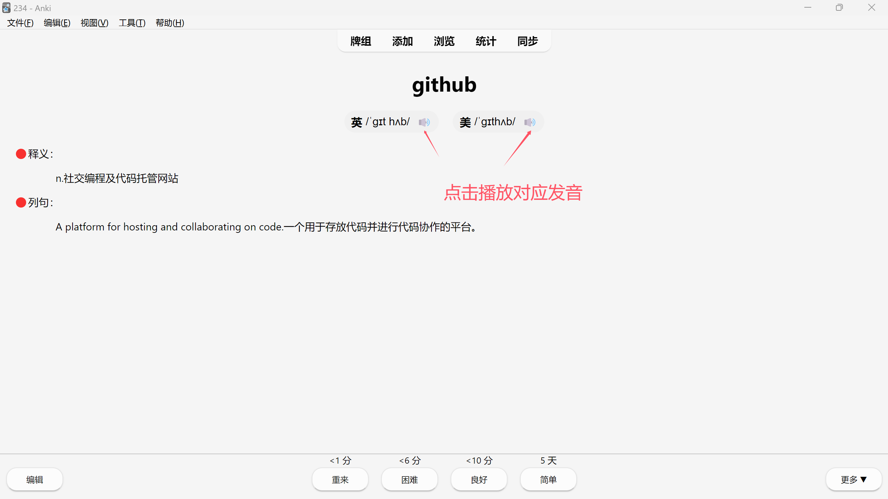

# 关于有道翻译api

api仅有两个参数，就是发音类型和单词，在audio=后面加上单词就ok了，type=0为美国发音，type=1为英国发音。

有道语音 api{0 为美音，1 为英音}
> 美：https://dict.youdao.com/dictvoice?type=0&audio=单词
> 英：https://dict.youdao.com/dictvoice?type=1&audio=单词

# 适配
适配Windows版Qt6，安卓版2.191，其它自行测试！

# 使用方法
* 一共有四个字段
   > 单词
   英式音标
   美式音标
   释义
   例句

* 将code里的代码复制到相应位置或者下载.apkg文件进入Anki点击导入牌组即可。

# 截图

